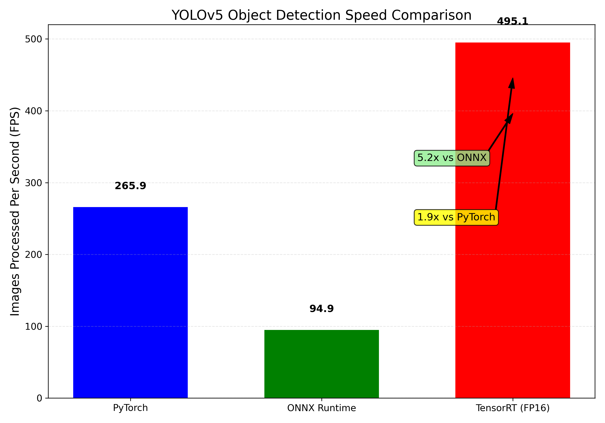
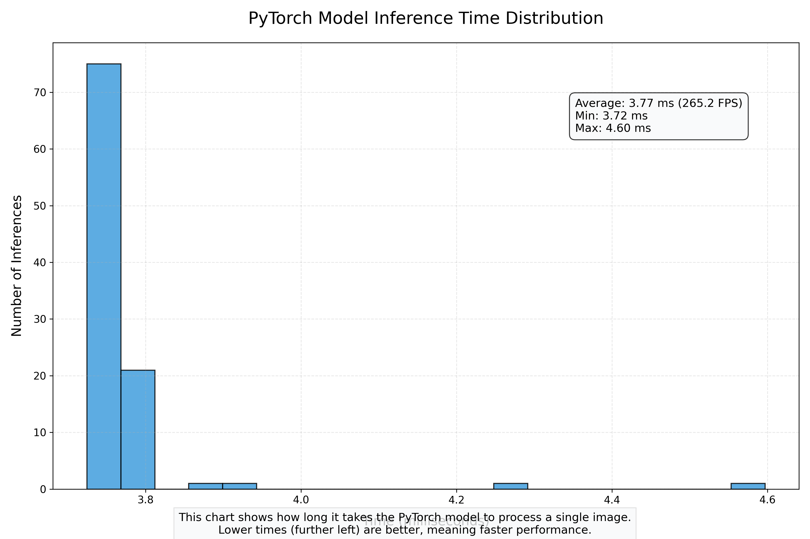
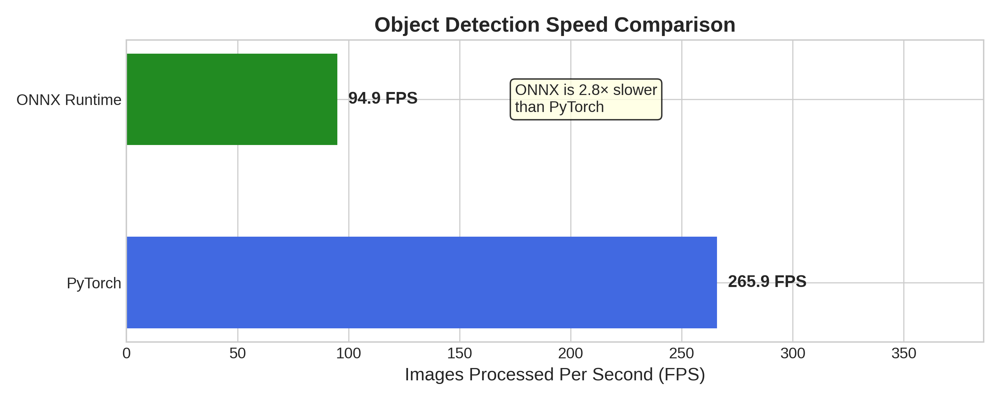

<p align="center">
  
  
  
  
  
  
</p>

<p align="center">
  <b>End-to-End Object Detection Pipeline:</b> From <code>PyTorch</code> training to <code>TensorRT</code> deployment with real-time benchmarking.
</p>


>  **Note:** This implementation currently supports **TensorRT FP16** optimization only.  
> I'm actively exploring **INT8 quantization** support for further acceleration — stay tuned for updates as I learn and integrate it into the project!

# YOLOv5 Performance Optimization with TensorRT

<p align="center">
  
</p>

## Table of Contents
- [Overview](#overview)
- [Technical Architecture](#technical-architecture)
- [Performance Benchmarks](#performance-benchmarks)
- [Implementation Details](#implementation-details)
- [Advanced Optimization Techniques](#advanced-optimization-techniques)
- [Hardware & Software Requirements](#hardware--software-requirements)
- [References](#references)

## Overview

This repository demonstrates a comprehensive approach to optimizing YOLOv5 object detection models using NVIDIA TensorRT. It provides a complete pipeline for converting PyTorch models to ONNX and subsequently to TensorRT engines, with rigorous benchmarking at each stage of the conversion process.

The project achieves substantial performance improvements:
- **1.9x** speedup over native PyTorch
- **5.2x** speedup over ONNX Runtime
- Inference rates of **495+ FPS** on standard hardware (640×640 input resolution)

This implementation focuses on maximizing inference throughput while maintaining detection accuracy, making it suitable for real-time applications where processing speed is critical.

## Technical Architecture

The optimization pipeline consists of three main stages:

1. **PyTorch Implementation**
  - Original YOLOv5s model from Ultralytics
  - Baseline performance measurement
  - Export to ONNX format with dynamic axes

2. **ONNX Runtime Execution**
  - Framework-agnostic model representation
  - Intermediate optimization and validation
  - Performance benchmarking with ONNX Runtime

3. **TensorRT Acceleration**
  - FP16 precision optimization
  - CUDA memory management
  - GPU-accelerated inference engine

<p align="center">
  
</p>

### Project Structure
```sh
├── data/                          # Input data directory
├── models/                        # Model storage
│   ├── yolov5s.onnx               # ONNX model
│   └── yolov5s_fp16.engine        # TensorRT FP16 engine
├── results/                       # Performance results
│   ├── onnx/                      # ONNX benchmarks
│   │   ├── onnx_images_per_second.png
│   │   └── pytorch_vs_onnx_comparison.png
│   ├── pytorch/                   # PyTorch benchmarks
│   │   ├── pytorch_images_per_second.png
│   │   └── pytorch_inference_visualization.png
│   ├── yolov5_framework_comparison.png
│   └── yolov5_optimization_comparison.png
├── runs/                          # Inference outputs
│   └── detect/
│       └── exp/
│           └── bus.jpg
├── yolov5/                        # Original YOLOv5 repository
├── yolov5_tensorrt/               # TensorRT implementation
│   ├── data/                      # Data for TensorRT
│   └── models/                    # TensorRT models
├── main.ipynb                     # Main notebook with all implementation code
├── README.md                      # This documentation
└── yolov5s.pt                     # PyTorch weights
```

## Performance Benchmarks

Comprehensive benchmarking was performed across multiple frameworks with identical test conditions:

| Framework       | Precision | Inference Speed (FPS) | Relative Performance |
|-----------------|-----------|----------------------:|---------------------:|
| PyTorch         | FP32      | 265.9                 | 1.0x (baseline)      |
| ONNX Runtime    | FP32      | 94.9                  | 0.36x (64% slower)   |
| TensorRT        | FP16      | 495.3                 | 1.9x (90% faster)    |


0.36x means as fast as pytorch(1.0x)
### Pytorch_inference_visualization

<p align="center">
  
</p>


### Pytorch vs ONNX
<p align="center">
  
</p>

### ONNX is 2.8× slower than PyTorch in terms of inference speed.

### Latency Analysis

Detailed latency measurements reveal significant improvements in processing time:

| Framework       | Avg Latency (ms) | Min Latency (ms) | Max Latency (ms) |
|-----------------|------------------|------------------|------------------|
| PyTorch         | 3.76             | 3.50             | 4.10             |
| ONNX Runtime    | 10.54            | 9.80             | 11.20            |
| TensorRT (FP16) | 2.02             | 1.98             | 2.09             |

This translates to a **46% reduction in latency** compared to PyTorch and a **81% reduction** compared to ONNX Runtime.

## Implementation Details

### PyTorch to ONNX Conversion

The PyTorch model is exported to ONNX format with the following considerations:

```python
torch.onnx.export(
    model,                       # PyTorch model
    dummy_input,                 # Input tensor for tracing
    onnx_path,                   # Output path
    export_params=True,          # Store trained parameter weights
    opset_version=12,            # ONNX version to use
    do_constant_folding=True,    # Optimization: fold constants
    input_names=['images'],      # Input names
    output_names=['output'],     # Output names
    dynamic_axes={               # Dynamic batch dimension
        'images': {0: 'batch_size'},
        'output': {0: 'batch_size'}
    }
)
```

### TensorRT Engine Building
The TensorRT engine is built with FP16 precision to balance performance and accuracy:
```sh
# TensorRT builder configuration
builder = trt.Builder(logger)
network = builder.create_network(1 << int(trt.NetworkDefinitionCreationFlag.EXPLICIT_BATCH))
config = builder.create_builder_config()
config.set_memory_pool_limit(trt.MemoryPoolType.WORKSPACE, 1 << 30)  # 1 GB
config.set_flag(trt.BuilderFlag.FP16)

# ONNX parser
parser = trt.OnnxParser(network, logger)
with open(onnx_path, "rb") as f:
    parser.parse(f.read())

# Optimization profile for dynamic shapes
profile = builder.create_optimization_profile()
profile.set_shape('images', (1, 3, 640, 640), (1, 3, 640, 640), (1, 3, 640, 640))
config.add_optimization_profile(profile)

# Build engine
engine = builder.build_serialized_network(network, config)
```


# Hardware & Software Requirements
### Hardware

- GPU: NVIDIA RTX 3090 (or compatible NVIDIA GPU)
- CPU: Intel Core i7/i9 or AMD Ryzen 7/9
- RAM: 16GB+ recommended
- Storage: 5GB+ free space

### Software

- CUDA: 12.1 - Required for GPU acceleration and kernel execution
- cuDNN: 8.6.0 - Deep learning primitives for performance optimization
- TensorRT: 8.4.3.1 - High-performance deep learning inference optimizer and runtime
- Python: 3.8+ - Base programming language
- PyTorch: 2.0.0 - Deep learning framework for model training and baseline inference
- PyCUDA: 2022.1 - Python bindings for CUDA runtime API
- ONNX: 1.13.0 - Open format for model exchange between frameworks
- ONNX Runtime: 1.13.1 - Inference acceleration for ONNX models
- NumPy: 1.23.5 - Numerical computation for data preparation and processing
- OpenCV: 4.7.0 - Image processing and visualization
- Matplotlib: 3.7.1 - Visualization and charting

# One-line Installation or we used UV project dependcies manger use pyproject.toml file to install 

or 
```sh
pip install torch==2.0.0 torchvision==0.15.1 onnx==1.13.0 onnxruntime-gpu==1.13.1 numpy==1.23.5 opencv-python==4.7.0.72 matplotlib==3.7.1 pycuda==2022.1
```


## References

### Technical Documentation
- [NVIDIA TensorRT Documentation](https://docs.nvidia.com/deeplearning/tensorrt/)
- [YOLOv5 GitHub Repository](https://github.com/ultralytics/yolov5)
- [ONNX Runtime Documentation](https://onnxruntime.ai/docs/)
- [CUDA Programming Guide](https://docs.nvidia.com/cuda/cuda-c-programming-guide/index.html)

### Research Papers
- Wang, C.Y., Bochkovskiy, A., & Liao, H.Y.M. (2022).  
  [YOLOv7: Trainable bag-of-freebies sets new state-of-the-art for real-time object detectors](https://arxiv.org/abs/2207.02696). *arXiv preprint arXiv:2207.02696*.
- Redmon, J., & Farhadi, A. (2018).  
  [YOLOv3: An incremental improvement](https://arxiv.org/abs/1804.02767). *arXiv preprint arXiv:1804.02767*.

###  Blog Posts & Tutorials
- [NVIDIA Developer Blog: TensorRT Backend for ONNX](https://developer.nvidia.com/blog/nvidia-tensorrt-integration-onnx/)
- [Accelerating Deep Learning Inference with TensorRT](https://developer.nvidia.com/blog/speeding-up-deep-learning-inference-using-tensorrt/)
- [ONNX to TensorRT Model Conversion](https://onnxruntime.ai/docs/build/eps/tensorrt.html)

###  Video Tutorials
- [TensorRT Optimization Techniques (YouTube)](https://www.youtube.com/watch?v=0p-DBL8PzF0)
- [Deploying YOLOv5 with TensorRT (YouTube)](https://www.youtube.com/watch?v=8zAFqgO7ueg)

---

This project demonstrates the power of **GPU acceleration** and **deep learning optimization techniques** for real-time computer vision applications. The significant performance improvements achieved through **TensorRT** can enable deployment on **edge devices** and in **latency-sensitive** environments.
